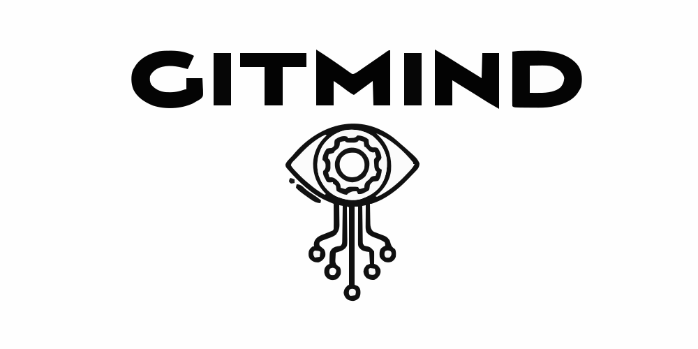

<!-- markdownlint-disable -->
<p align="center">
  <!-- github-banner-start -->
  
  <!-- github-banner-end -->
</p>
<!-- markdownlint-restore -->

# Gitmind

## Local Development

### Prerequisites

- A compatible python version. It's recommended to use [pyenv](https://github.com/pyenv/pyenv) to manage
python versions.
- [pdm](https://github.com/pdm-project/pdm) installed.
- [pre-commit](https://pre-commit.com) installed.
- [hatch](https://hatch.pypa.io) installed,

### Setup

1. Clone the repository
3. Inside the repository, install the dependencies with:
   ```shell
      pdm install
   ```
   This will create a virtual env under the git ignored `.venv` folder and install all the dependencies.
3. Install the pre-commit hooks:
   ```shell
      pre-commit install && pre-commit install --hook-type commit-msg
   ```
   This will install the pre-commit hooks that will run before every commit. This includes linters and formatters.

### Linting

To lint the codebase, run:
```shell
   pdm run lint
```

### Testing

To run the tests, run:
```shell
   pdm run test
```

Tip: You can also run the linters configured in `pyproject.toml` inside your IDE of choice.
