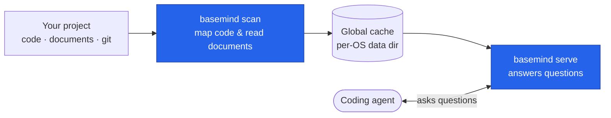
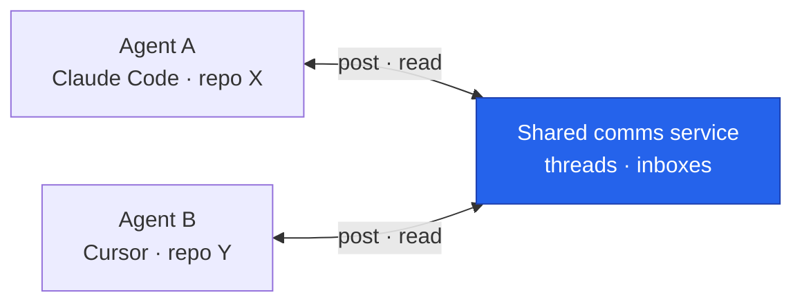

<!-- markdownlint-disable MD033 MD041 -->
<div align="center">


**The context and communication layer for coding agents.**

basemind turns any repo into an always-current map of its code, documents, history, and memory —
so agents answer from **structure and search** instead of burning their context window on `grep` and
file reads — and gives a team of agents a **shared channel to coordinate** while they work. One
server does both.

Code map across **300+ languages** · documents in **90+ formats** · semantic + full-text search ·
git history & blame · shared memory · web crawl · agent-to-agent comms

[](https://basemind.ai)
[](https://crates.io/crates/basemind)
[](https://www.npmjs.com/package/basemind)
[](https://pypi.org/project/basemind/)
[](https://github.com/Goldziher/basemind/actions/workflows/ci.yaml)
[](LICENSE)

[Docs](https://basemind.ai) · [Install](#installation) · [Features](#what-you-get) · [How it works](#how-it-works) · [Performance](#performance) · [CLI](#cli-reference)

</div>

---

<!-- markdownlint-disable MD013 -->
<p align="center"></p>
<p align="center"><em>An agent reasoning from structure — <code>outline</code> + <code>find_references</code> in a live session, statusline tracking tokens saved.</em></p>
<!-- markdownlint-enable MD013 -->

<div align="center"><sub><a href="#demos">More demos ↓</a></sub></div>

---

## What you get

basemind answers with **file paths, line numbers, and signatures — not whole files** — so a question
about your code costs a small fraction of the tokens it takes to read the source.

<!-- markdownlint-disable MD013 -->

| Capability | What it does | Key tools |
|---|---|---|
| **Code intelligence** | Find where things are defined, what calls what, who implements what, how calls chain, the overall architecture (hub modules + dependency cycles), how any two symbols relate, and the repo's de-facto modules — traverse the typed code-graph for a symbol's neighborhood, the shortest path between two symbols, or a readable subgraph, cluster it into communities, and export the whole graph as node-link JSON / DOT / Mermaid / GraphML / Cypher, a self-contained offline interactive HTML page, or a static SVG picture — optionally written to the cache — every edge tagged with provenance + confidence. **Precise, scope- and import-aware resolution** (JS/TS via oxc, Python & Java via in-tree [stack-graphs](#how-it-works)) layered over [300+ languages](#how-it-works). | `outline` · `search_symbols` · `find_references` · `find_callers` · `goto_definition` · `call_graph` · `architecture_map` · `neighbors` · `path` · `subgraph` · `communities` · `graph_export` · `find_implementations` · `find_files` · `workspace_grep` |
| **Git intelligence** | Ask what changed recently, who last touched a function, where the churn is, how a file's structure differs across commits, and full-text search commit authors + messages. | `blame_symbol` · `symbol_history` · `recent_changes` · `hot_files` · `diff_outline` · `commits_touching` · `search_git_history` |
| **Document search** | Search PDFs, Office files, HTML, email, and images by meaning — with built-in text extraction and OCR, no extra setup. | `search_documents` |
| **Code search** | Find source code by meaning, term, or symbol — `mode` picks the strategy: `hybrid` (default, RRF fusion of vector + BM25 + exact-symbol lanes), `semantic` (vector KNN), or `keyword` (native BM25); optional `rerank` cross-encoder pass. Returns pointers, fetch bodies with `get_chunk`. Needs `--features code-search`. | `search_code` · `get_chunk` |
| **Shared memory** | A per-repo memory agents can write to and search; clones of the same repo share it, unrelated repos stay separate. | `memory_put` · `memory_search` · `memory_audit` |
| **Suggestions** | Spots files that change together and suggests notes worth saving — you approve before anything is kept. | `proposals_mine` · `proposal_accept` |
| **Web crawl** | Fetch a page or follow links from a starting URL; results join the document search above. | `web_scrape` · `web_crawl` · `web_map` |
| **Agent comms** | Threads for agents working the same repo: each addressed by at least two of subject / path-glob / members, discovered by scope (member, cwd path-match, or subject filter — never global), with a recency-filtered inbox. The creator manages membership and archives; idle threads auto-archive. One orchestrator can drive many named subagents (`as_agent`). | `thread_start` · `thread_post` · `thread_list` · `inbox_read` · `inbox_wait` · `agent_list` |
| **Agent shells** | Let agents open, type into, and watch terminal sessions in the background. | `shell_spawn` · `shell_send` · `shell_capture` · `shell_list` |
| **Token saving** | Hand an agent a file's outline instead of its full text, pull back only the one function it needs, diff a re-read instead of resending it whole, checkpoint a session, and flag wasteful tool use. | `compress` · `expand` · `delta` · `checkpoint` · `detect_waste` |
| **Admin** | Refresh the index, see what's been queried, and check or clean up the on-disk cache. | `rescan` · `telemetry_summary` · `cache_stats` |
| **Machine registry** | Machine-wide repo/worktree/branch coordination, backed by the daemon's always-on registry. Advisory claims let agent sessions avoid colliding on the same worktree. | `workspaces` · `worktrees` · `branches` · `worktree_claim` · `worktree_release` |

<!-- markdownlint-enable MD013 -->

---

## Installation

Three ways to run basemind, easiest first. All three share the same local index and are safe to run
side by side.

> **The plugin downloads the basemind program for you** on first use. The MCP-server and CLI paths
> need it installed yourself — see [Install the program](#install-the-program).

### 1. As a plugin (recommended)

The plugin sets up everything for you — the server, the helper skills, the agent-comms features, and
the slash commands. Pick your coding tool.

<details>
<summary><strong>Claude Code</strong></summary>

In the session (not your shell), run in order:

```text
/plugin marketplace add Goldziher/basemind
/plugin install basemind@basemind
```

Restart, then run `/bm-statusline` once to turn on the live statusline (a one-time step — see
[Statusline](#install-the-program)). **Turn on auto-update for the `basemind` marketplace**
(Claude Code's plugin manager): the plugin then tracks each new release automatically, and the
launcher resolves the latest *published* release, so you always get the current index format and
tool set and startup stays reliable even during a release. Prefer to control timing? Update the
marketplace regularly by hand instead.

</details>

<details>
<summary><strong>Codex</strong></summary>

```bash
codex plugin marketplace add Goldziher/basemind
codex plugin add basemind@basemind
```

In the app: open the **Plugins** sidebar and add basemind. The CLI and IDE share one config file.
The plugin starts the latest published GitHub release from the project workspace; it never runs from
the installed plugin cache or races a shared `npx` install.

</details>

<details>
<summary><strong>Cursor</strong></summary>

In Agent chat: `/add-plugin basemind` (once listed), or go to **Dashboard → Settings → Plugins →
Team Marketplaces → Import from Repo** and point it at `https://github.com/Goldziher/basemind`.

</details>

<details>
<summary><strong>Gemini CLI</strong></summary>

```bash
gemini extensions install https://github.com/Goldziher/basemind
```

Update later with `gemini extensions update basemind`.

</details>

<details>
<summary><strong>Factory Droid</strong></summary>

```bash
droid plugin marketplace add https://github.com/Goldziher/basemind
droid plugin install basemind@basemind
```

</details>

<details>
<summary><strong>GitHub Copilot CLI</strong></summary>

```bash
copilot plugin marketplace add Goldziher/basemind
copilot plugin install basemind@basemind
```

</details>

<details>
<summary><strong>OpenCode</strong></summary>

Add to `opencode.json` (project) or `~/.config/opencode/opencode.json` (global):

```json
{ "plugin": ["basemind-opencode@latest"] }
```

</details>

<details>
<summary><strong>Kimi Code</strong></summary>

```text
/plugins install https://github.com/Goldziher/basemind
```

Kimi doesn't support the comms auto-notifications, but the chat tools still work.

</details>

<details>
<summary><strong>Hermes</strong></summary>

Hermes exposes MCP servers through config, so basemind's tools are wired there. Two steps — the
binary + MCP wiring gives you the tools; a small standalone plugin package adds the helper skills,
slash commands, and comms notifications.

First [install the program](#install-the-program) (Homebrew / npm / cargo / release — **not** pip),
then add the server to `~/.hermes/config.yaml` (this is what gives you the 60+ tools):

```yaml
mcp_servers:
  basemind:
    command: basemind
    args: [serve]
```

For the helper skills, slash commands, and agent-comms notifications, install the standalone plugin
into the same Python environment Hermes runs in, then enable it (general plugins are opt-in):

```bash
pip install basemind-hermes-plugin
hermes plugins enable basemind
```

The plugin is pure-Python and ships no binary — it shells out to the `basemind` you installed above.
Comms auto-notifications are best-effort; the chat tools work regardless.

</details>

<details>
<summary><strong>Antigravity &amp; pi</strong></summary>

**Antigravity** uses a shared MCP config — [install the program](#install-the-program), then add the
[generic MCP block](#2-as-an-mcp-server). If you already use the Gemini extension,
`agy plugin import gemini` brings it across.

**pi**: `pi install git:github.com/Goldziher/basemind`. pi has no MCP support, so basemind runs
through its [CLI](#3-as-a-cli) here.

</details>

### 2. As an MCP server

If your tool speaks MCP but you're not using the plugin, [install the program](#install-the-program),
then register it:

```json
{
  "mcpServers": {
    "basemind": { "command": "basemind", "args": ["serve"] }
  }
}
```

Each tool says whether it only reads or can change things, so your client can auto-approve the safe
ones and ask before the rest. If `basemind` isn't found, use the full path from `which basemind`.

<details>
<summary><strong>Per-tool specifics</strong> (Claude Code · Cursor · Windsurf · Codex · Gemini · Copilot · Droid · Cline · Continue · OpenCode · Hermes)</summary>

- **Claude Code** — `claude mcp add basemind -- basemind serve` (add `--scope user` for all
  projects; the `--` is required). Or commit a `.mcp.json` at the repo root with the block above.
- **Cursor** — put the block above in `.cursor/mcp.json` (project) or `~/.cursor/mcp.json` (global).
- **Windsurf** — `~/.codeium/windsurf/mcp_config.json` (or Cascade → MCP servers → manage), then
  **Refresh**.
- **Codex** — `codex mcp add basemind -- basemind serve`, shared by the CLI and IDE.
- **Gemini CLI** — `gemini mcp add basemind basemind serve`, or the block above in
  `~/.gemini/settings.json`.
- **GitHub Copilot CLI** — `/mcp add` in-session, or `~/.copilot/mcp-config.json` with
  `"type": "local"` and `"tools": ["*"]`.
- **Factory Droid** — `droid mcp add basemind "basemind serve"`, or `~/.factory/mcp.json`.
- **Cline** — MCP Servers icon → Configure → add the block above.
- **Continue** — `.continue/mcpServers/basemind.yaml` with `command: basemind`, `args: [serve]`.
- **OpenCode (without the plugin)** — `opencode.json` under key `mcp`, with `command` as an array
  `["basemind", "serve"]`.
- **Hermes** — `mcp_servers.basemind` in `~/.hermes/config.yaml` (YAML: `command: basemind`,
  `args: [serve]`). For helper skills + comms notifications, `pip install basemind-hermes-plugin`
  (a standalone pure-Python plugin, no binary), then `hermes plugins enable basemind` — see the
  Hermes plugin section above.
- **Any other tool** — point it at the command `basemind` with the argument `serve`.

</details>

### 3. As a CLI

The standalone program, for scripts, headless runs, and CI. [Install it](#install-the-program), then:

```bash
basemind scan                          # index the project once
basemind query symbol "parseQuery"     # find a symbol by name
basemind query references "processFile" # find everywhere it's called
basemind git blame-file src/main.rs    # who last changed each line
basemind watch                         # keep the index fresh as files change
```

Full command list in the [CLI reference](#cli-reference).

### Install the program

The MCP and CLI paths need `basemind` available on your system. (The plugin does this for you.)

<!-- markdownlint-disable MD013 -->

| Channel | Command | Includes |
|---|---|---|
| Homebrew | `brew install Goldziher/tap/basemind` | everything |
| npm | `npm install -g basemind` | everything |
| pip | `pip install basemind` | everything |
| cargo | `cargo install basemind --locked` | code + git only |
| cargo (full) | `cargo install basemind --features full --locked` | everything |
| GitHub releases | [Download a binary](https://github.com/Goldziher/basemind/releases) | everything |

<!-- markdownlint-enable MD013 -->

The Homebrew / npm / pip / GitHub downloads include the full feature set — documents, OCR, search,
web crawl, shared memory, agent comms, and agent shells — so the first run downloads the models it
needs. The plain `cargo install` builds the code-map and git tools only.

### Get started

After installing, run **`basemind init`** (CLI) — or **`/bm-init`** if your tool supports slash
commands — from the repo root. It's re-runnable and safe to call again later:

- Writes a commented `basemind.toml` scaffold at the repo root, if one doesn't already exist.
- Lets you pick which capabilities to advertise (interactive prompt in a TTY, or non-interactive
  with `--yes`, `--with <capability>`, `--without <capability>`). Capability slugs:
  `code-search-navigation`, `code-mapping-architecture`, `git-history`, `agent-comms`,
  `documents-rag`, `semantic-search`.
- Injects a "prefer basemind over grep/read/git" rules block into your repo's agent-instructions
  file — `.ai-rulez/rules/basemind-usage.md` if `.ai-rulez/config.toml` is present (run
  `ai-rulez generate` afterward), else `CLAUDE.md`, else `AGENTS.md`, else a new `CLAUDE.md`. The
  block is delimited (`<!-- BEGIN basemind ... -->` / `<!-- END basemind -->`) so re-running
  replaces it in place instead of duplicating it.

Preview changes without writing with `--print`; skip the rules step with `--no-rules`; steer the
target explicitly with `--rules-target <auto|claude|agents|ai-rulez|none>`.

<details>
<summary><strong>Statusline</strong> (Claude Code)</summary>

Run `/bm-statusline` once. This is a one-time step because Claude Code doesn't let plugins set the
main statusline themselves — so basemind asks the assistant to make the one-line settings change on
your behalf, and it sticks from then on.

It shows two lines:

```text
Opus · basemind · ⎇ main · 12% ctx
◆ basemind  ●  1,247 files · 23m ago  │  312 calls · 180 srch · 44 git · 12 docs  │  1.4M saved  │  ✉ 3 @reviewer
```

The dot is green when basemind is live and fresh, amber when idle, red when stale. The middle shows
activity by type, then tokens saved, then unread messages. Adjust with
`BASEMIND_STATUSLINE=full|compact|minimal`, or hide the top line with `BASEMIND_STATUSLINE_CONTEXT=0`.

</details>

---

## Demos

<!-- markdownlint-disable MD013 -->

<p align="center"></p>
<p align="center"><em>The same engine from the CLI — <code>scan</code>, then symbol / reference / call-graph / blame queries.</em></p>

<p align="center"></p>
<p align="center"><em>Searching documents by meaning, not keywords, across 90+ formats.</em></p>

<p align="center"></p>
<p align="center"><em>Multi-agent code-review panel: named reviewers coordinate in a repo-scoped thread (post, reply, synthesize) — entirely over <code>basemind comms</code>.</em></p>

<!-- markdownlint-enable MD013 -->

---

## How it works

<details>
<summary><strong>From one scan to instant answers</strong></summary>

`basemind scan` reads your project once, in parallel. It maps your code with
[tree-sitter] (across [300+ languages][tslp]) and pulls text out of your documents with
[xberg], then saves the result to a global cache under the XDG data directory, keyed by workspace —
nothing is written into your repo. After that, `basemind serve` keeps the map in memory and answers
questions instantly — no re-reading the project for each one. When files change, it updates only what
changed. A single background daemon on the machine is the sole writer to that cache, so multiple
`serve` sessions on the same repo (or on different worktrees of it) all read and write concurrently
instead of one falling back read-only. See [Global cache & the daemon](#how-it-works) below.

Navigation is **scope- and import-aware** for JavaScript/TypeScript, **Python, and Java**: basemind
resolves each use to the definition it actually binds to, so a shadowed local isn't confused with an
import and `goto_definition` lands on the right target (including across files for imports). Every
other language still gets fast tree-sitter scope binding. Precise Python/Java resolution runs GitHub
stack-graphs-style `.tsg` name-binding rules via an in-tree engine (`crates/`), with no per-language
LSP server.

Resolution **refines, but never shrinks, a result set.** `find_callers` reports every call site whose
callee matches the name — the same sound floor `find_references` uses — and marks each hit `resolved`
when resolution proved it binds to that definition (`resolved_total` counts them). It deliberately
does *not* return only the resolved subset: resolution cannot see through a module-object import
(`from pkg import mod` then `mod.f()`) or an unresolvable path alias, so filtering to it would drop
real callers and report the remainder as complete. Filter on `resolved` when you want precision; trust
`total` when you need completeness.

Markdown and Obsidian vaults are first-class: headings become navigable symbols (so `outline` and
`search_symbols` work over a notes vault); `[[wikilinks]]`, `![[embeds]]`, and standard
`[text](Note.md)` links all become references — so `find_references "Note"` returns that note's
backlinks regardless of link style; and `#tags` (inline or in YAML frontmatter) become references
too, so `find_references "#project"` lists every note carrying that tag.


```mermaid
flowchart LR
  A(["Coding agent"])
  R["Your project<br/>code · documents · git"]
  S["basemind scan<br/>map code & read documents"]
  D[("Global cache<br/>per-OS data dir")]
  V["basemind serve<br/>answers questions"]
  R --> S --> D --> V
  A <-->|asks questions| V
  classDef accent fill:#2563eb,stroke:#1e40af,color:#fff
  class S,V accent
```

Search and memory are powered by a vector store ([LanceDB]).

</details>

<details>
<summary><strong>Index lifecycle &amp; freshness</strong></summary>

`basemind serve` answers the MCP handshake immediately and warms the code map into memory in the
background, so a client never blocks waiting for a large repo to load. The `status` tool reports
`warming` (still loading) and, once done, `warm_ms`; a first-time index build similarly reports
`indexing` / `index_build_ms`.

While the server isn't fully ready, `status` and every code-map read tool may carry a `notice`
object — `{ state, message, retry }` — instead of (or alongside) their normal result:

| `state` | Meaning | `retry` |
|---|---|---|
| `warming_up` | Loading an existing index into memory. | `true` |
| `building_index` | Indexing from scratch (no cache entry for this workspace yet). | `true` |
| `rescanning` | Incremental rescan after a file change; current results are usable but may be stale. | `false` |

Treat an empty or partial result carrying a `notice` as "retry shortly," not "no matches" — poll
`status` (or just retry the call) until the notice clears.

</details>

<details>
<summary><strong>Global cache &amp; the daemon</strong></summary>

Index state lives under a single global cache — `~/.local/share/basemind/` on Linux,
`~/Library/Application Support/basemind/` on macOS (override with `BASEMIND_DATA_HOME`) — keyed by
workspace, never inside your repo. The
content-addressed blob store is machine-wide too: identical file content scanned from different repos
or worktrees is extracted and stored once.

A single background daemon per machine is the sole writer to that cache. `basemind serve` opens its
store read-only and forwards writes (scan / rescan) to the daemon over a local socket, so N `serve`
sessions on the same repo — or on different worktrees of it — all read and write concurrently instead
of a second session silently falling back to a stale, read-only view. The daemon also keeps a cheap,
always-on registry of repos, worktrees, and branches (`workspaces` / `worktrees` / `branches`), and
`worktree_claim` / `worktree_release` give agent sessions an advisory way to avoid colliding on the
same worktree.

`basemind statusline` queries the daemon for the workspaces currently active and prints a compact
line for your shell prompt; it prints nothing when no daemon is running.

</details>

<details>
<summary><strong>How agents coordinate</strong></summary>

A single shared service in the background lets agents talk to each other — even across different
tools and different repos on the same machine. Agents coordinate in **threads** — each addressed by
at least two of subject / path-glob / members, discovered by scope rather than joined globally — and
each has a personal **inbox**. Messages come in two parts: a short headline (subject and sender)
that's cheap to skim, and the full body, fetched only when an agent wants to read it. An agent never
sees its own posts in its inbox. Idle threads auto-archive.

The plugin makes sure agents notice messages without being asked — through the built-in instructions,
a notice at session start and each turn, and a quiet background check every few seconds.


```mermaid
flowchart LR
  A["Agent A<br/>Claude Code · repo X"]
  B["Agent B<br/>Cursor · repo Y"]
  BR["Shared comms service<br/>threads · inboxes"]
  A <-->|post · read| BR
  B <-->|post · read| BR
  classDef accent fill:#2563eb,stroke:#1e40af,color:#fff
  class BR accent
```

</details>

<details>
<summary><strong>Agent shells</strong></summary>

Included in every prebuilt download (and in `cargo install --features shells` / `full`): agents can
open terminal sessions in the background, type into them, and read what's on screen — no extra tools
to install. Sessions can be fully headless, or opened in a real terminal tab or window so you can
watch along. A spawned session and the agent that started it can message each other over comms.

</details>

---

## Token saving

<details>
<summary><strong>Good habits the plugin sets up for you</strong></summary>

The plugin nudges agents toward the cheap path by default:

- Get a file's outline before opening it — then read only the part you need.
- Search for a definition instead of grepping for it.
- Look up who calls a function instead of grepping for call sites.
- Refresh the index after edits instead of restarting the server.
- Don't re-read a file basemind already mapped.

Optional guardrails enforce this at the moment a tool is used:

- **Guard** — gently redirects `grep`-style searches to the matching basemind tool. On by default;
  set `BASEMIND_GUARD=off` to disable, or `redirect` to block instead of nudge.
- **Output compressor** — `BASEMIND_COMPRESS_OUTPUT=1` shrinks long command output. It never touches
  anything that looks like a credential and leaves output alone if it can't help.
- **Re-read shortcut** — `BASEMIND_DELTA_READS=1` shows just what changed when an agent re-reads a
  file it already read this session.

</details>

<details>
<summary><strong>Compression that understands code</strong></summary>

basemind shrinks code by keeping the shape and dropping the bodies — function signatures and imports
stay, the implementations go — because a signature is useless without its shape. For prose it does a
light cleanup (extra whitespace, filler, repeated paragraphs). It reports honest before/after token
counts, and the code version is exact — nothing is lost, just set aside. `expand` brings any one
function's full body back when an agent actually needs it: compress to an outline, expand only what
you need.

</details>

---

## Performance

<details>
<summary><strong>Scan speed</strong></summary>

Measured on an Apple M4 (10 cores — 4 performance + 6 efficiency, 16 GB, macOS 26) with the
hardening harness (`scripts/harden.sh`), which clones each upstream repo fresh and scans its code
map. Warm, steady-state numbers; the first scan of a cold project is slower.

| Project | Files | Languages | Scan time |
|---|---|---|---|
| gin | 130 | Go | 0.1 s |
| requests | 128 | Python | 0.1 s |
| ripgrep | 221 | Rust | 0.6 s |
| tokio | 861 | Rust | 0.4 s |
| react | 7 242 | TS / JSX | 2.0 s |
| django | 7 065 | Python | 2.4 s |
| TypeScript compiler | 81 324 | TS / JS / JSON | 18 s |

The TypeScript compiler is the worst case — 81k files in about 18 seconds. Re-scans only look at
what changed, so keeping a project up to date is far faster than the first scan.

Once running, most code questions answer in **under a millisecond**, symbol and call-graph searches
in a few milliseconds, and document search in around 200 ms — because the map is held in memory
rather than read from disk each time.

</details>

<details>
<summary><strong>Git history queries</strong></summary>

basemind precomputes a per-repo git-history index (path → commit posting lists, stored newest-first)
so the history tools — `commits_touching`, `recent_changes`, `hot_files`, `find_commits_by_path`,
and `symbol_history`'s commit walk — are posting-list lookups. Warm in-process query latency on the
same M4:

| Repo | Commits | `commits_touching` | `recent_changes` | index build | index size |
|---|---|---|---|---|---|
| django | 2 000 | 39 µs | 15 µs | 0.5 s | 1.7 MB (6 % of `.git`) |
| tokio | 3 984 | 37 µs | 13 µs | 0.9 s | 2.1 MB (12 %) |
| requests | 6 480 | 38 µs | 15 µs | 1.0 s | 1.9 MB (14 %) |
| TypeScript | 2 000 | 37 µs | 13 µs | 3.2 s | 30 MB (12 %) |

History queries answer in **tens of microseconds**, flat across history depth, because the
newest-first posting lists decode only the commits a query returns. The index builds in well under a
second to a few seconds and costs **6–22 % of `.git`** on disk.

It is a pure accelerator: the tools use it only when it is fresh (`last_indexed_head == HEAD`) and
otherwise walk history directly, so it can never serve stale results — and it rebuilds automatically
when history is rewritten (filter-repo / rebase / force-push). Reproduce with
`cargo bench --bench git_history` or the git-ops block in `scripts/harden.sh`.

</details>

<details>
<summary><strong>Measuring query latency (<code>elapsed_us</code>)</strong></summary>

Every latency-relevant tool — the code-map tools (`outline`, `search_symbols`, `find_references`,
`find_callers`, `find_files`, `list_files`, `workspace_grep`, `dependents`, `goto_definition`,
`status`, `repo_info`, `call_graph`, `find_implementations`, `architecture_map`, `search_code`), the
git tools (`recent_changes`, `commits_touching`, `find_commits_by_path`, `blame_file`,
`blame_symbol`, `hot_files`, `diff_file`, `diff_outline`, `working_tree_status`, `symbol_history`,
`search_git_history`), and the document / memory search tools — reports its own latency as
**`elapsed_us`** on its response. Don't wrap the CLI in `time`; ask basemind.

Resolution is **microseconds** on purpose: an indexed `commits_touching` is ~37 µs, so millisecond
granularity would round the hot path to `0`.

**What `elapsed_us` includes** — the tool body's own execution: index and store lookups, git walks,
ranking, and building the response.

**What it excludes** — MCP / JSON-RPC transport (which the server cannot observe), argument
deserialization, and serialization of the response itself. Excluding encoding keeps the number
comparable across `format: "json"` and `format: "toon"` and across result-set sizes: it reports
*query* cost, not *encoding* cost.

**The one caveat, stated plainly:** most read tools begin by awaiting the in-RAM code map, and the
git tools lazily build their history index on first use. Both waits happen *inside* the measured
region, so a first call against a cold server is much slower than the steady-state call after it.
When the server is still warming or building, the response carries a `notice`
(`warming_up` / `building_index` / `rescanning`) — **discard any sample carrying a `notice`** if you
are measuring steady-state latency.

The CLI adds a second number, `startup_us`, covering process startup: clap parsing, the tokio runtime,
the store open, and the config/git-cache load. It is reported separately because it is exactly the
part of a `time basemind …` measurement that was never the query — and a long-running MCP server pays
it once at boot, not per call:

```console
$ basemind query search run_workspace_grep --limit 1 --json
{
  ...
  "elapsed_us": 90,        # the query
  "startup_us": 957887     # everything else a `time` wrapper would have charged to it
}

$ basemind query references parse_kind --limit 3
...
(6.5 ms query · 852.9 ms startup)
```

That first example is the whole point: the query took 90 µs, while the process spent ~0.96 s getting
ready to run it. A `time basemind …` wrapper would have reported the second number and told you
nothing about the first.

</details>

---

## Configuration

<details>
<summary><strong>Config file &amp; overrides</strong></summary>

The config lives at the **repo root** as `basemind.toml` (committed). The cache it drives is derived
state — held in the global cache under the XDG data directory, wiped and rebuilt on schema bumps —
so config never belongs there and nothing basemind-owned is written into your repo. Run
`basemind init` to drop a fully-commented scaffold (documenting every option) at the root. The legacy
in-cache path (`.basemind/basemind.toml`, from before the global-cache move) is still read as a
fallback for older checkouts. The full schema is at `schema/basemind-config-v1.schema.json`:

```toml
# basemind.toml  (repo root — commit this)
"$schema" = "v1"

[scan]
respect_gitignore = true
# Follow symlinks during the walk. Off by default — symlinks often escape the repo (e.g. Bazel's
# bazel-* convenience symlinks). Turn on for repos that symlink real source into place.
follow_symlinks = false
# `exclude` is ADDED ON TOP of an always-on floor (node_modules, target, dist, build, out, .venv,
# venv, __pycache__, *.pyc, .pytest_cache/.mypy_cache/.ruff_cache/.tox, .next/.nuxt/.svelte-kit,
# vendor, .gradle, .terraform, coverage, bazel-*, .git, .basemind, .idea, .DS_Store). You can add to
# it but not remove a floor entry.
exclude = []
# Index directories outside the repo root too — e.g. a Bazel external repo cache — so their
# symbols resolve in search / references / outlines. External files are keyed by absolute path;
# (re-)indexed on a full `basemind scan` only (not live-watched). extra_roots always follow symlinks.
extra_roots = ["/private/var/tmp/_bazel_you/abc123/external"]

[code_intel]
# Precise, scope- and import-aware resolution (JS/TS via oxc; Python/Java via stack-graphs). On by
# default. Set false to fall back to fast tree-sitter locals binding for every language. Applies to
# files (re)scanned after the change.
precise_resolution = true

[documents]
enabled = true
# Embed documents for semantic search (ON — embeddings pay off on real prose / OCR).
embed = true
# Model preset: fast | balanced (default, 768-dim) | quality | multilingual.
# Changing the preset forces a FULL RE-EMBED of the corpus (time + CPU): every document is
# re-encoded at the new model's dimension.
embedding_preset = "balanced"
# Documents that are extracted + indexed but never embedded (keyword-only).
embed_exclude = []
# Route archives (.zip/.tar/.jar/…) into the recursive extractor. Off by default so one archive
# can't explode into thousands of embeds; true binaries are always skipped.
extract_archives = false

[code_search]
enabled = true
# Vector embeddings for code are OFF by default — a general English model on code isn't worth the
# cost, and NL→symbol is already served by the BM25 keyword lane. Chunking + keyword search work
# regardless. Turn on only for vector search over code (downloads an ONNX model, re-embeds on
# preset change).
embed = false
embed_exclude = []
```

Any tool call can override these settings for that one request, and settings map to environment
variables in the obvious way: `--llm-api-key` becomes `BASEMIND_LLM_API_KEY`.

</details>

---

## CLI reference

<details>
<summary><strong>Full command list</strong> — query · git · memory · suggestions · cache · web · comms · shells</summary>

CLI commands mirror the MCP tools 1:1 (enforced by `tests/cli_parity.rs`). Add `--json` for
machine-readable output.

<!-- markdownlint-disable MD013 -->

**Query (`basemind query`)**

| Command | Purpose |
|---|---|
| `outline <path> [--l2]` | A file's structure: symbols, lines, signatures. `--l2` adds calls + docs. |
| `symbol <needle> [--kind]` | Find a symbol by name, optionally filtered by kind. |
| `search <needle>` | Text search across indexed files. |
| `references <name>` | Find everywhere a name is called. |
| `callers <path> <name> [--kind]` | Find callers of one specific definition. |
| `goto-definition <path> <line> [--column]` | Resolve a reference position to its scope-resolved definition. |
| `implementations <trait>` | Types that implement or inherit from a name. |
| `call-graph <name> [--direction --max-depth]` | Walk the call chain up or down. |
| `architecture-map [--granularity --focus --depth --edges --include-churn]` | Deterministic architecture overview: hub modules/symbols ranked by graph centrality + churn, plus dependency cycles (SCCs). `--edges` selects lanes (`calls`/`imports`/`inherits`/`both`/`all`); every edge carries a provenance tag (`extracted`/`inferred`/`ambiguous`) + confidence. |
| `grep <pattern> [--language --path-contains]` | Pattern search with filters. |
| `list-files [--path-contains --language]` | List indexed files. |
| `status` / `repo-info` | Project overview / git info (branch, HEAD, origin). |
| `dependents <module>` | What imports a given module. |
| `search-code <query> [--limit --format]` | Semantic (vector) search over code chunks; returns pointers. Needs `--features code-search`. |
| `get-chunk <path> [--chunk-id --byte-start]` | Fetch one code chunk's source body (the `search-code` fetch half). |
| `expand <path> <name> [--kind]` | A symbol's raw source body (the inverse of an outline entry). |

**Git (`basemind git`)**

| Command | Purpose |
|---|---|
| `working-tree-status` | What's staged and unstaged right now. |
| `recent-changes [--limit]` | Recent commits with their files. |
| `search <pattern> [--field author\|message\|all] [--limit]` | Full-text search over commit history at full branch depth. |
| `commits-touching <path>` / `find-commits-by-path <pattern>` | Commits for a path or pattern. |
| `hot-files [--limit]` | The most frequently changed files. |
| `diff-file <path> <old> <new>` / `diff-outline <path> [--rev]` | File or structure diff across commits. |
| `blame-file <path>` / `blame-symbol <path> <name>` | Who last changed each line / a symbol. |
| `symbol-history <path> <name>` | When a symbol's body changed over time. |

**Memory (`basemind memory`)**

| Command | Purpose |
|---|---|
| `put <key> <value>` / `get <key>` / `delete <key>` | Store, retrieve, or remove a value. |
| `list [--prefix]` | List keys, optionally by prefix. |
| `search <query>` | Search stored values by meaning. |
| `search-documents <query>` | Search documents and memory together. |

**Suggestions (`basemind governance`)**

| Command | Purpose |
|---|---|
| `mine [--commits --min-count --min-confidence --max-files]` | Suggest notes from files that change together. |
| `proposals [--kind --limit]` | List pending suggestions. |
| `accept <id> [--key]` / `reject <id> [--reason]` | Keep a suggestion / dismiss it for good. |
| `audit [--key --individual --dry-run --include-archived]` | Recompute memory importance, archive stale entries, refresh verdicts. |

**Cache (`basemind cache`)**

| Command | Purpose |
|---|---|
| `stats` | Disk footprint (per-component + total, matches `du`) and process RAM. |
| `gc` | Reclaim unused space (safe while the server runs). |
| `clear --component <comp>` | Clear part of the cache (`views`, `blobs`, `git-cache`, `all`, …). |

**Web (`basemind web`)**

| Command | Purpose |
|---|---|
| `scrape <url>` | Fetch and index a single page. |
| `crawl <seed-url>` | Follow links from a starting URL. |
| `map <url>` | Discover a site's pages without fetching bodies. |

**Comms (`basemind comms`)**

| Command | Purpose |
|---|---|
| `thread-start [--subject --path --member]` / `threads [--subject-contains]` | Start a thread (addressed by ≥2 of subject / path / members) / list threads discoverable to you. |
| `join <thread>` / `leave <thread>` / `members <thread>` | Join, leave, or list the members of a thread. |
| `add-member <thread> <id>` / `remove-member <thread> <id>` / `archive <thread>` | Manage membership and archive a thread (creator only). |
| `post <thread> <subject> [--body --reply-to --tag]` | Post a message to a thread. |
| `history <thread> [--since-hours]` / `inbox [--mark-read]` / `wait [--thread --timeout-secs]` | A thread's history / your cross-thread inbox / block until a peer posts. |
| `read <id>` | Read one message body in full. |
| `register --name <handle>` / `agents [--thread]` | Set your handle / list active agents. |
| `daemon` / `start` / `stop` / `status` | The broker daemon: run it, ensure it, stop it, or inspect pid / version / uptime. |

**Shells (`basemind shells`, `--features shells`)**

| Command | Purpose |
|---|---|
| `spawn <command> [--cwd --env --title]` | Start a detached headless shell session; prints a `session_id`. |
| `send <session-id> <text> [--no-enter]` | Type into a session's stdin. |
| `capture <session-id> [--lines]` | Read a session's visible screen. |
| `kill <session-id>` / `list` | End a session / list live sessions. |
| `broadcast <text> --session <id>…` | Send the same input to several sessions at once. |

**Other commands (`scan`, `serve`, `watch`, …)**

| Command | Purpose |
|---|---|
| `scan` / `rescan <path>` | Full scan / update one path. |
| `watch` | Keep the index fresh as files change (no server). |
| `serve [--no-watch]` | Start the server (keeps the index fresh by default). |
| `init` | Re-runnable onboarding: write `basemind.toml`, select capabilities, inject usage rules. |
| `lang <list\|install\|clean>` | Manage downloaded language grammars. |
| `hook install` | Add a git pre-commit hook that runs a scan. |
| `compress-output` / `delta --old <path>` | Backends for the optional guardrails above. |
| `checkpoint` / `detect-waste` | Summarize a session / flag wasteful tool use. |
| `telemetry` | What's been queried and how many tokens were saved. |

<!-- markdownlint-enable MD013 -->

</details>

---

## License

MIT — see [LICENSE](LICENSE).

[tree-sitter]: https://tree-sitter.github.io/tree-sitter/
[tslp]: https://github.com/Goldziher/tree-sitter-language-pack
[xberg]: https://github.com/xberg-io/xberg
[LanceDB]: https://github.com/lancedb/lancedb
